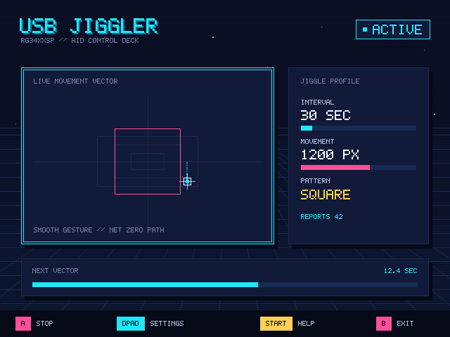

# USB Mouse Jiggler for RG34XXSP

A safe, gamepad-first PortMaster utility that turns an RG34XXSP running muOS 2 NeXT into a configurable USB HID mouse.



## Features

- Retro-neon fullscreen 640×480 interface controlled entirely by the handheld gamepad
- Persistent 1–300 second interval and 1–2,000 pixel movement settings
- Horizontal, Vertical, Square, and Random net-zero patterns
- Smooth mouse-like trajectories using legal relative HID reports roughly every 16 ms
- Automatic validated USB gadget setup, retry, and ownership-aware cleanup
- Non-blocking preparing, active, disconnected, error, help, exit, and cleanup screens
- No kernel flashing, boot-image modification, reboot, installer, or restore path

## Compatibility

The bundled module is validated only for:

- Anbernic RG34XXSP
- muOS 2 NeXT / 2601.0 JACARANDA
- Linux `4.9.170 #2 SMP PREEMPT`
- AArch64 Allwinner H700 / `sun50iw9p1`
- SDL 2.28.5

Do not reuse `kernel/usb_f_hid.ko` on a different kernel build. Setup verifies exact module provenance before loading it.

## Install

1. Extract `usbjiggler-portmaster.zip` to the SD-card storage root while preserving directories.
2. Confirm these paths exist:
   - `ROMS/Ports/usbjiggler.sh`
   - `ports/usbjiggler/usbjiggler`
3. Open **Ports → USB Mouse Jiggler**.
4. Connect the RG34XXSP USB-C port to the host computer.

The application prepares its private HID gadget automatically. It refuses to disturb an existing UDC owner and removes only resources owned by the current invocation.

## Controls

| Control | Action |
| --- | --- |
| D-pad Up/Down | Open settings and select a row |
| D-pad Left/Right | Adjust the selected value; hold to accelerate |
| A | Start, stop, retry, select, or confirm |
| B | Back or open exit confirmation |
| Start | Open or close help |

Settings are stored atomically in `ports/usbjiggler/usbjiggler.cfg`. Safe defaults are 30 seconds, 2 pixels, and Horizontal.

## Runtime behavior

**READY** means validated setup completed and `/dev/hidg0` opened successfully. Press A to start. Each timer event performs a smooth gesture and returns the cursor to its starting position. Press A again to stop future cycles.

On **DISCONNECTED** or **ERROR**, check the USB-C connection and press A for a safe cleanup-and-retry cycle. B → A exits through the visible cleanup screen. The launcher converts INT, TERM, and HUP into a bounded TERM shutdown for the app, waits for cleanup, stops GPTOKEYB, and only then calls `pm_finish`.

Logs are written to `ports/usbjiggler/log.txt`. If cleanup reports failure, do not load another gadget; inspect the log and run the packaged validated cleanup helper before retrying.

## Core artifact hashes

| Artifact | SHA-256 |
| --- | --- |
| `usbjiggler` | `09eae28993dc9c36329726deb5a1e70219657bf2dccd7d2206492b891c588cd9` |
| `kernel/usb_f_hid.ko` | `5a3cfc769fd592c8f8ad7aa4238df6d1c1c70e72de5ad923eb334280a35e07a9` |
| `kernel/usb_f_hid.ko.provenance` | `f31c7f9fd82b2a25654d6ebd6b41e88442b7cd2dc1368bbd05f8e087a17de0e9` |
| `scripts/gadget_setup.sh` | `9033f293e83be55ee4a0065802e6589e703e782a9e6d64709fd29a49389bf98f` |
| `scripts/gadget_cleanup.sh` | `2b4c6b28dc87d840f273a97a779313ca6a5e19a077a19870f608fd8176cb4b2c` |
| `screenshot.png` | `7fc8a4eace20af3ed9e8364c2760866ed497895f35a0f115d9b3e274444bfbd9` |

The release also contains `ARTIFACTS.sha256` with every packaged file hash, while `usbjiggler-portmaster.zip.sha256` verifies the archive itself. See [`docs/portmaster-validation.md`](docs/portmaster-validation.md) for acceptance evidence and [`docs/ui-flow.md`](docs/ui-flow.md) for screen behavior.

## Development

```sh
./build_app.sh --test
SDL_CFLAGS="..." ./build_app.sh --ui-test
CC=aarch64-linux-gnu-gcc SDL_CFLAGS="..." TARGET_SDL="..." ./build_app.sh
./build_app.sh --package
```

Builds use C11 with `-Wall -Wextra -Werror -Wpedantic`. Cross-builds supplied through `TARGET_SDL` verify the audited SDL 2.28.5 library hash `40d0616f6b97d447f47e1e77c116d84bc4d3d7a5e33a50e2f4f472f9b250f46d`; the final AArch64 binary requires no GLIBC symbol newer than 2.17.
